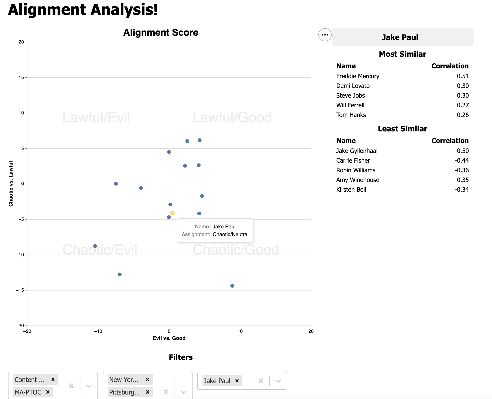

# Alignment Analysis
## Project Background

In the game Dungeons & Dragons, characters have "alignments" that describe their basic moral and ethical attitudes. There are two parts to an alignment: one dimension tells how good or evil a character is, and the other part tells how lawful or chaotic they are.

One day back in 2019, a few coworkers and I got into a friendly debate about the D&D alignment of various people at our company.  Who at the company is good?  Evil?  Who is chaotic?  Lawful?

To answer this question, we designed a fun survey that quizzed people about their workplace habits, asking questions like:
- How do you respond when mistakenly added to a reply-all?
- How many browser tabs do you have open right now?
- Which is your favorite Slack Channel?

Each question could have two to four answers, which we then assigned a "trait" to an answer. For instance, choosing "Filter or trash subsequent replies" in response to being stuck on a reply-all chain would be scored "lawful good"; replying all back would be scored "chaotic evil".   (A full list of questions, answers, and scores can be found in `alignment_analysis/database/etl/data/question_bank.csv`)

Because there was some skew to answers, we normalized scores and combined the normalized scores to calculate where a person fell within the Lawful/Chaotic and Good/Evil dimensions.

This repo contains a simple web app that displays a scatterplot of people's scores.  It also lists who answered most similarly to a given user, as well as who answered least similarly.

*Note that the names in this repo are masked with celebrity names out of respect for people's privacy.*

## Technical Background
This app is written in Python and Flask on the backend, ClojureScript on the frontend, and Postgres for the database.

## Running the app
The easiest way to run the app is by running docker-compose, which will build both the ClojureScript and Python apps and set up a Postgres instance.

This can be done by running the following commands:
```
docker-compose up --build
```

You can access the deployment by going to http://localhost:5000/.

## Using the app
By default, the app will display all respondents' scores on the scatterplot.  However, you can drill down on specific teams and locations, or even specific respondents.  Filtering on team(s) or locations(s) will have an impact on the available selections for other filters.

If you hover over a given dot, you can see the score.  Alternatively, by selecting a user from the drop down, that user will be highlighted in yellow.  Selecting a specific user will also prompt a "correlation chart" that shows who the user answered most and least similarly to.



## Caveats / areas of improvement
This project is definitely rough around the edges!  Some areas of concern / improvements:

From an analytical perspective, I never finished this app, so some additional analyses:
- Drill down on how many people answered a question a given way
- Scored according to department / team to find out the most lawful / evil / etc. team
- Show who answered a given question a given way

From a technical perspective:
- This was a very early foray into frontend development.  It could definitely be prettier :-)
- This isn't productionalized.  Ideally, I'd have written some tests and separated the build and deployment of the frontend and backend (and, had I chosen to make it available to the web at large, I'd probably have used Zappa to host it and set up an AWS database)